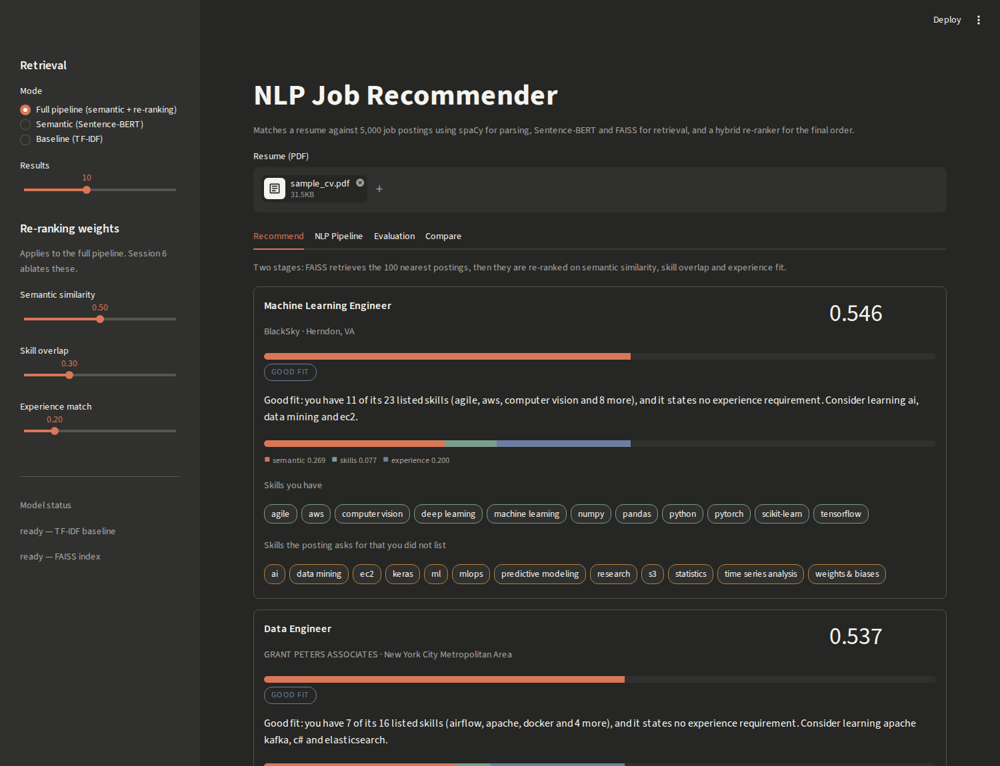
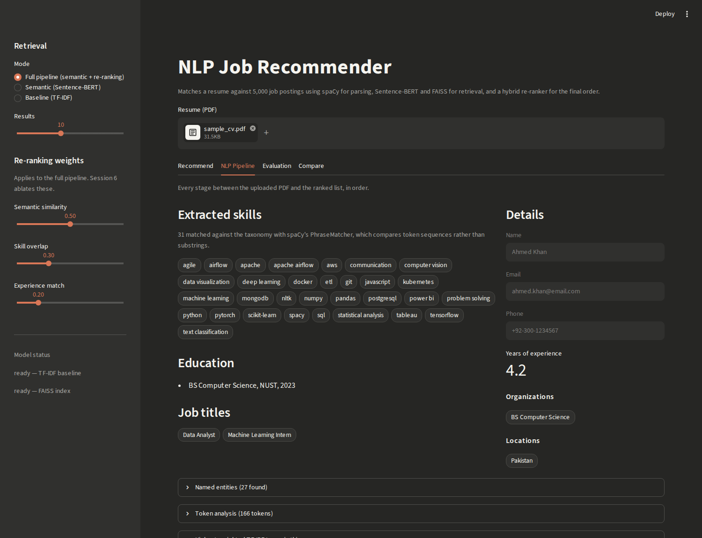
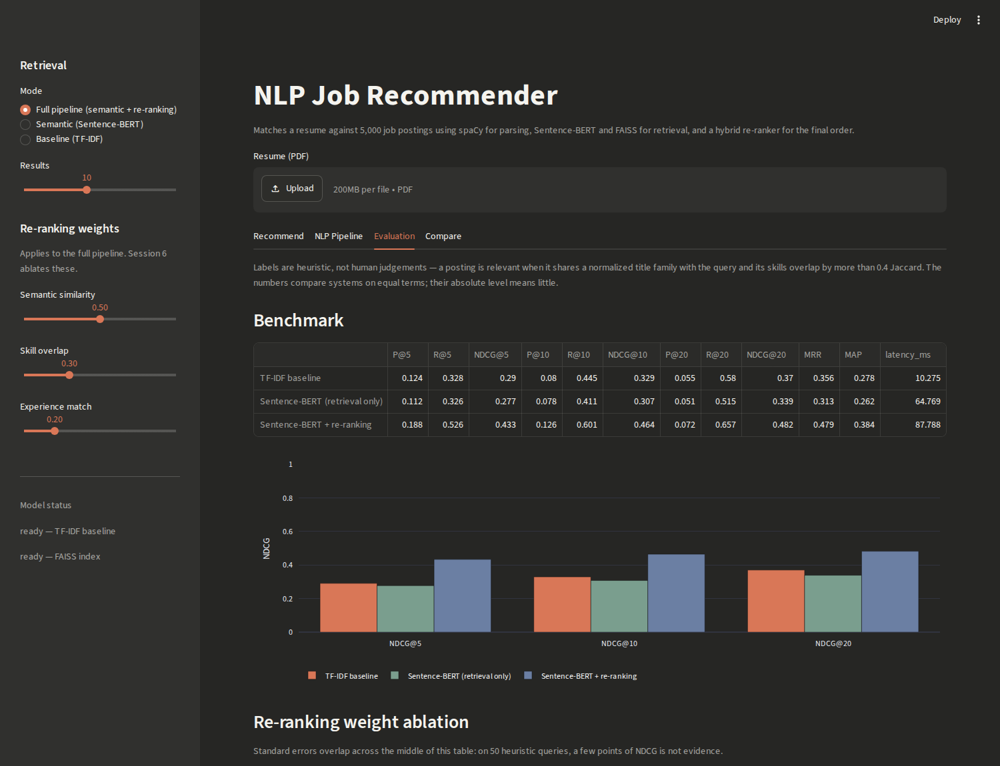
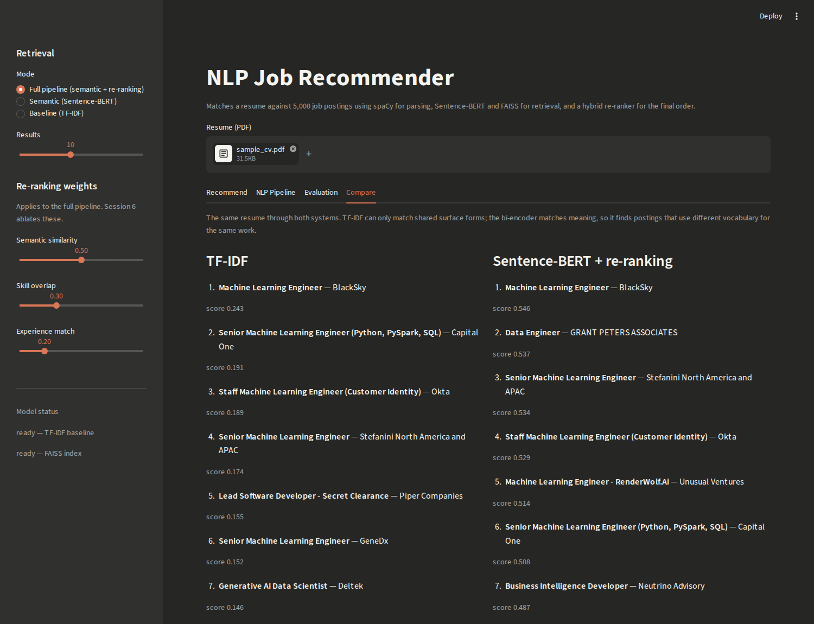

# NLP Job Recommender

Matches a resume against 5,000 real job postings and explains every result.
Built on classical and neural NLP — spaCy for parsing, TF-IDF for the sparse
baseline, Sentence-BERT and FAISS for dense retrieval, and a hybrid re-ranker
for the final order. **No LLM anywhere in the pipeline.**

Upload a PDF resume and the system extracts your skills, experience and
education, retrieves the closest postings, re-ranks them on how well you
actually fit, and tells you in plain English what you are missing.



## Results

Three systems measured on the same 50-query evaluation set:

| System | NDCG@10 | P@10 | R@10 | MRR | MAP | latency |
|---|---|---|---|---|---|---|
| TF-IDF baseline | 0.329 | 0.080 | 0.445 | 0.356 | 0.278 | 10 ms |
| Sentence-BERT (retrieval only) | 0.307 | 0.078 | 0.411 | 0.313 | 0.262 | 65 ms |
| **Sentence-BERT + re-ranking** | **0.464** | **0.126** | **0.601** | **0.479** | **0.384** | 88 ms |

The full pipeline improves NDCG@10 from **0.329 to 0.464** over the sparse
baseline, a 41% relative gain. Full tables in
[`results/benchmark.md`](results/benchmark.md).

Two results here are worth reading carefully rather than skipping:

- **Dense retrieval alone loses to TF-IDF** (0.307 vs 0.329). That is not a bug.
  The evaluation labels are built from job-title text and extracted skills —
  both lexical signals — so they systematically favour a lexical matcher. The
  honest reading is that re-ranking, not the embedding, is what carries this
  system.
- **Semantic-only re-ranking scores exactly the same as retrieval-only**
  (0.307 in both). That is a deliberate consistency check: putting all the
  weight on the semantic component should reproduce the retrieval order
  untouched, and it does.

## Architecture

```
  resume.pdf                                    postings.csv (124k rows)
      │                                                │
      ▼                                                ▼
┌──────────────────┐                        ┌──────────────────────┐
│ pdf_parser       │  pdfplumber            │ data_loader          │
│                  │  header/footer strip   │  dedupe, sample 5k   │
└────────┬─────────┘                        │  skills + experience │
         ▼                                  └──────────┬───────────┘
┌──────────────────┐                                   ▼
│ resume_parser    │  spaCy NER                  jobs.parquet
│                  │  PhraseMatcher  ◄── shared ──┐    │
│                  │  (455 skills)     taxonomy   │    │
└────────┬─────────┘                              │    │
         │ profile: skills, titles,               │    │
         │ education, years                       │    │
         ▼                                        │    ▼
   ┌─────┴─────────────────────┐                  │  ┌─────────────────┐
   ▼                           ▼                  │  │ build_index     │
┌──────────────┐    ┌─────────────────────┐       │  │ 5000 × 384      │
│ TF-IDF       │    │ Sentence-BERT       │       │  │ L2-normalized   │
│ 50k vocab    │    │ all-MiniLM-L6-v2    │       │  └────────┬────────┘
│ 1-2 grams    │    │ bi-encoder, 384-dim │       │           ▼
└──────┬───────┘    └──────────┬──────────┘       │    models/jobs.faiss
       │ cosine                │                  │           │
       │                       ▼                  │           │
       │            ┌─────────────────────┐       │           │
       │            │ FAISS IndexFlatIP   │ ◄─────┼───────────┘
       │            │ STAGE 1: top 100    │       │
       │            └──────────┬──────────┘       │
       │                       ▼                  │
       │            ┌─────────────────────┐       │
       │            │ hybrid re-ranker    │       │
       │            │ STAGE 2             │ ◄─────┘
       │            │  0.50 semantic      │
       │            │  0.30 skill Jaccard │
       │            │  0.20 experience    │
       │            └──────────┬──────────┘
       │                       ▼
       │            ┌─────────────────────┐
       │            │ explainer_rules     │  templated, no LLM
       │            └──────────┬──────────┘
       ▼                       ▼
  ranked list          ranked list + readiness label + explanation
```

## How retrieval works

**Baseline — TF-IDF.** Each posting becomes a sparse vector over a 50,000-term
1-2 gram vocabulary, weighted by term frequency times inverse document
frequency, compared by cosine similarity. It matches only on shared surface
forms: a resume saying "neural networks" and a posting saying "deep learning"
score exactly zero against each other. That limitation is why the neural system
exists, and the baseline is kept so the two can be compared.

**Semantic — Sentence-BERT + FAISS.** A two-stage retrieve-and-rank pipeline:

1. **Retrieval.** `all-MiniLM-L6-v2` embeds every posting once, offline, into a
   384-dimension vector. Vectors are L2-normalized, so FAISS `IndexFlatIP`
   inner-product search *is* cosine search. A query returns the 100 nearest.
2. **Re-ranking.** Those 100 are rescored on signals a single vector cannot
   carry:

   ```
   final = 0.50 * semantic_similarity
         + 0.30 * skill_overlap        (Jaccard over the shared taxonomy)
         + 0.20 * experience_match     (candidate years vs. stated requirement)
   ```

Scoring all 5,000 postings on every signal would waste effort on thousands that
are obviously irrelevant, while retrieval alone cannot tell that a candidate is
two years short of a requirement.

Resumes and postings are matched against **one** skills vocabulary
(`data/skills_taxonomy.txt`) using the same `PhraseMatcher`, so the skill overlap
score compares like with like.

## NLP techniques

| Concept | Where |
|---|---|
| Text extraction from unstructured documents | `src/pdf_parser.py` (pdfplumber) |
| Tokenization | `src/preprocessing.py` (spaCy) |
| Lemmatization | `src/preprocessing.py` (spaCy) |
| Stopword and punctuation removal | `src/preprocessing.py` (spaCy) |
| Part-of-speech tagging | `src/preprocessing.py` (spaCy) |
| Named entity recognition | `src/resume_parser.py` (spaCy NER) |
| Gazetteer / pattern matching | `src/resume_parser.py` (`PhraseMatcher`) |
| Bag-of-words and TF-IDF vectorization | `src/baseline_tfidf.py` (scikit-learn) |
| N-gram features | `ngram_range=(1, 2)` in the vectorizer |
| Cosine similarity | both retrieval systems |
| Dense transformer embeddings | `src/embedder.py` (Sentence-BERT) |
| Bi-encoder architecture | `all-MiniLM-L6-v2`, siamese fine-tuning |
| Approximate nearest-neighbour search | `src/build_index.py` (FAISS) |
| Sparse vs. dense retrieval comparison | `src/evaluate.py` |
| IR evaluation metrics | `src/evaluate.py` — P@k, R@k, NDCG@k, MRR, MAP |

Every metric is implemented from scratch with its formula in the docstring.

## Ablation

The re-ranking weights were tested rather than asserted
([`results/ablation.md`](results/ablation.md)):

| Weights (semantic / skills / experience) | NDCG@10 | ± s.e. | wins / losses vs default |
|---|---|---|---|
| semantic heavy — 0.70 / 0.20 / 0.10 | 0.483 | 0.052 | 11 / 9 |
| **default — 0.50 / 0.30 / 0.20** | **0.464** | 0.051 | — |
| skills only — 0.00 / 1.00 / 0.00 | 0.453 | 0.051 | 6 / 14 |
| equal thirds — 0.33 / 0.33 / 0.33 | 0.439 | 0.051 | 2 / 9 |
| skills heavy — 0.30 / 0.50 / 0.20 | 0.434 | 0.049 | 2 / 14 |
| semantic only — 1.00 / 0.00 / 0.00 | 0.307 | 0.053 | 3 / 27 |
| experience only — 0.00 / 0.00 / 1.00 | 0.259 | 0.050 | 1 / 30 |

Dropping either major component alone costs a lot, so the hybrid is doing real
work. Among the *blends*, the standard errors overlap and the win/loss counts
are close to even — "semantic heavy" nominally tops the table but wins on 11
queries and loses on 9, which on 50 heuristic queries is a coin flip. The
default was therefore left alone rather than tuned to the top row, which would
be fitting noise.

## Limitations

The evaluation labels are **heuristic, not human judgements**. A posting counts
as relevant when it shares a normalized job-title family with the query *and*
its extracted skills overlap by more than 0.4 Jaccard. Consequences:

- Those same signals feed the retrievers, so the benchmark measures internal
  consistency more than true relevance. The numbers are comparable *between*
  systems; their absolute level means little.
- Relevance is binary, while real relevance is graded and personal.
- Title families are lexical, so "Data Scientist" and "Machine Learning
  Engineer" never match despite being near-identical jobs.
- Only queries with at least one relevant posting are kept, biasing the sample
  towards crowded title families.

`src/build_eval_set.py` states these in full. Replacing them with human
judgements is the single biggest improvement available to this project.

Three further honest notes, all found by running real resumes through the
finished system rather than by reading the code:

- `en_core_web_sm` misses many real employers and labels technology names as
  organizations. Entities that are already matched as skills are filtered out,
  but the underlying model is weak.
- The taxonomy is technical, so roughly 19% of postings — genuinely
  non-technical ones — extract no skills at all.
- **Soft skills dominate the overlap signal for non-technical resumes.** A
  nursing CV extracts mostly generic skills (communication, attention to detail,
  time management), which a great many unrelated postings also list. The
  re-ranker then scores an "Administrative Support Assistant" close to a nursing
  role. A fine-tuned skills NER, or simply down-weighting skills that appear in
  a large share of the corpus, would address this.

## Setup

```bash
python -m venv venv
source venv/bin/activate
pip install -r requirements.txt
```

Python 3.11 or 3.12 is recommended; several of these libraries do not yet ship
wheels for 3.13+. The spaCy model is pinned in `requirements.txt`, so no
separate download step is needed.

## Build

Put the [LinkedIn Job Postings dataset](https://www.kaggle.com/datasets/arshkon/linkedin-job-postings)
CSV at `data/raw/postings.csv`, then:

```bash
python -m src.data_loader       # ~2 min   -> data/processed/jobs.parquet
python -m src.baseline_tfidf    # ~10 s    -> models/tfidf_*.joblib
python -m src.build_index       # ~5.5 min -> models/jobs.faiss
python -m src.build_eval_set    # ~5 s     -> data/eval/eval_set.json
python -m src.evaluate          # ~1 min   -> results/benchmark.md, ablation.md
```

`models/` and most of `data/` are gitignored, so these run after cloning. The
index build downloads the `all-MiniLM-L6-v2` weights (~80 MB) on first run.

## Run

```bash
streamlit run app.py
```

## Tests

```bash
pytest
```

215 tests. The IR metrics are checked against expectations worked out by hand
from the formulas, so an error in the implementation cannot hide by being
compared against itself.

## Screenshots

| NLP pipeline | Evaluation |
|---|---|
|  |  |

Side-by-side comparison of the two retrieval systems:



## Layout

```
data/raw/                 job postings dataset (gitignored)
data/processed/           jobs.parquet, built by src/data_loader.py
data/skills_taxonomy.txt  455 skills, the shared gazetteer (tracked)
data/eval/                heuristic evaluation set
models/                   FAISS index and fitted vectorizers (gitignored)
results/                  benchmark and ablation reports
src/config.py             all paths and tunable constants
src/pdf_parser.py         PDF text extraction
src/preprocessing.py      tokenization, lemmatization, stopword removal
src/resume_parser.py      NER, skill matching, profile fields
src/data_loader.py        job corpus loading, cleaning, enrichment
src/baseline_tfidf.py     sparse TF-IDF baseline
src/embedder.py           Sentence-BERT wrapper, unit-normalized vectors
src/build_index.py        one-time FAISS index build
src/recommender.py        two-stage retrieve-and-rank
src/build_eval_set.py     heuristic labelled evaluation set
src/evaluate.py           IR metrics, benchmark, ablation
src/explainer_rules.py    templated explanations, no LLM
notebooks/                data exploration and evaluation
app.py                    Streamlit UI
```

## Future work

- **Learning-to-rank re-ranker.** The current stage-2 weights are fixed and
  hand-set. With interaction data (clicks, applications) an XGBoost or
  LambdaRank model could learn them per query instead.
- **Fine-tuned skills NER.** The gazetteer cannot recognise a skill outside its
  vocabulary. A token-classification model trained on annotated job text would
  generalise to new tools as they appear, and would fix the ~19% of postings
  that currently extract nothing.
- **Cross-encoder re-ranking.** A cross-encoder reads the resume and one posting
  *together* and is substantially more accurate than a bi-encoder. Too slow for
  5,000 postings, but ideal for re-scoring the 100 candidates stage 1 already
  narrowed down to — a natural next retrieval improvement.
- **Collaborative filtering.** With enough interaction data, "candidates like
  you also applied to…" adds a signal that no amount of text analysis can
  recover from the posting alone.
- **Human relevance judgements.** The largest single improvement: even a few
  hundred hand-labelled query-posting pairs would replace the heuristic labels
  and make the absolute numbers meaningful.
- **LLM-generated explanations.** The rule-based explainer is grounded and free.
  An LLM layer alongside it would allow a genuine comparison on cost, latency
  and output quality — the rule-based version is the control.
